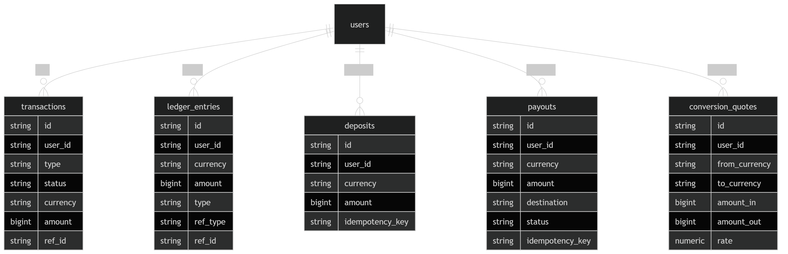

# README.md

## Overview

Kite is a multi-currency wallet backend built in Go using a ledger-based architecture.
The system supports:

* Authentication (signup/login)
* Deposits
* Currency conversion
* Payouts
* Transaction history
* Multi-currency balances
* Idempotent operations
* Double-entry ledger accounting

The system is designed with financial correctness in mind where the ledger acts as the source of truth for balances.

---

# Running the Project

## Requirements

* Docker
* Docker Compose

---

## Start the application

```bash id="r1"
docker compose up --build
```

This starts:

* Go API server
* PostgreSQL database

---

## Environment Variables

Create a `.env` file:

```env id="r2"
PORT=8080

DATABASE_URL=postgres://postgres:password@db:5432/kite?sslmode=disable

JWT_SECRET=supersecret
```

---

# Architecture Overview

The application follows a layered architecture:

```text id="a1"
Handler → Service → Repository → Database
```

---

## Layers

### Handlers

Responsible for:

* request validation
* HTTP responses
* extracting auth context

---

### Services

Responsible for:

* business logic
* transactions
* orchestration
* validation

---

### Repositories

Responsible for:

* database access
* queries
* persistence

---

# Key Design Decisions

## 1. Ledger-Based Accounting

Balances are not stored directly.

Instead, balances are derived from ledger entries:

```text id="a2"
credits - debits
```

This improves consistency and auditability.

---

## 2. Double Entry Ledger for Conversions

Currency conversion creates:

```text id="a3"
debit source currency
credit target currency
```

This ensures financial consistency.

---

## 3. Transactions vs Ledger Separation

### Transactions Table

Stores business events:

```text id="a4"
deposit
conversion
payout
```

---

### Ledger Entries

Stores actual money movement.

This separation improves:

* auditability
* reporting
* scalability

---

## 4. Idempotency

Deposit and payout operations use idempotency keys to prevent duplicate processing.

---

# Data Model

## Entity Relationship Overview



---

# Core Flows

## Deposit Flow

```text id="f1"
create deposit
    ↓
create transaction record
    ↓
credit ledger
    ↓
commit db transaction
```

---

## Conversion Flow

```text id="f2"
create quote
    ↓
validate balance
    ↓
create transaction record
    ↓
debit source currency
    ↓
credit destination currency
    ↓
commit db transaction
```

---

## Payout Flow

```text id="f3"
validate balance
    ↓
create payout record
    ↓
create transaction record
    ↓
debit ledger
    ↓
commit db transaction
```

---

# Trade-offs

## 1. Balance Computation from Ledger

Current implementation calculates balances dynamically:

```sql id="t1"
SUM(credits - debits)
```

### Pros

* accurate
* auditable
* simple

### Cons

* slower at scale

### Future Improvement

Introduce a cached balances table updated transactionally.

---

## 2. Synchronous Processing

Operations execute synchronously.

### Pros

* simpler logic
* easier debugging

### Cons

* not ideal for high throughput

### Future Improvement

Use async job queues for payouts and external settlement flows.

---

## 3. Simple FX Rate Engine

FX rates are currently static/mock-based.

### Future Improvement

Integrate real-time FX providers.

---

# Scaling to 1M Users

## What Would Break First

### 1. Balance Queries

Current balance computation:

```sql id="s1"
SUM(...)
FROM ledger_entries
```

would become expensive.

### Solution

* maintain materialized balances
* introduce balance snapshots
* use Redis caching

---

### 2. Transaction Pagination

Offset pagination becomes inefficient at scale.

### Solution

Switch to cursor-based pagination.

---

### 3. Database Contention

High concurrent writes could create locking contention.

### Solution

* partition ledger tables
* use read replicas
* shard by user/account

---

### 4. Payout Throughput

Synchronous payout processing would bottleneck.

### Solution

Use queue workers:

```text id="s2"
API
 → Queue
 → Workers
 → Settlement Provider
```

---

# Future Improvements

* Real-time FX providers
* Webhooks
* Fraud detection
* Balance snapshots
* Distributed job processing
* Retry systems
* Audit exports
* Multi-region deployment

---

# Tech Stack

* Go
* Gin
* PostgreSQL
* Docker
* JWT Authentication

---

# Financial Safety Principles

The system enforces:

* idempotent operations
* transactional consistency
* double-entry accounting
* balance validation before debits

---

# API Summary

| Method | Endpoint               | Description        |
| ------ | ---------------------- | ------------------ |
| POST   | `/auth/signup`         | Register user      |
| POST   | `/auth/login`          | Authenticate user  |
| GET    | `/wallet/balances`            | Get balances       |
| POST   | `/deposits`            | Create deposit     |
| POST   | `/conversions/quote`   | Create FX quote    |
| POST   | `/conversions/execute` | Execute conversion |
| POST   | `/payouts`             | Create payout      |
| GET    | `/transactions`        | List transactions  |


## 🎥 Video Demo

[](https://www.tella.tv/video/app-financial-workflow-demo-4utp)